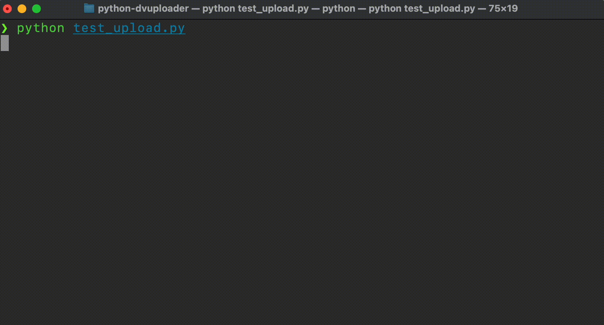

<p align="center">
    <h1 align="center">Python DVUploader</h1>
</p>

Python equivalent to the [DVUploader](https://github.com/GlobalDataverseCommunityConsortium/dataverse-uploader) written in Java. Complements other libraries written in Python and facilitates the upload of files to a Dataverse instance via [Direct Upload](https://guides.dataverse.org/en/latest/developers/s3-direct-upload-api.html).

**Features**

* Parallel direct upload to a Dataverse backend storage
* Files are streamed directly instead of being buffered in memory
* Supports multipart uploads and chunks data accordingly

-----

<p align="center">
    
</p>

-----

## Getting started

To get started with DVUploader, you can install it via pip:

```bash
python3 -m pip install git+https://github.com/gdcc/python-dvuploader.git
```

## Quickstart

In order to perform a direct upload, you need to have a Dataverse instance running and a cloud storage provider. The following example shows how to upload files to a Dataverse instance. Simply provide the files of interest and utilize the `upload` method of a `DVUploader` instance.

```python
from dvuploader import DVUploader, File

files = [
    File(filepath="./small.txt"),
    File(directoryLabel="some/dir", filepath="./medium.txt"),
    File(directoryLabel="some/dir", filepath="./big.txt"),
]

DV_URL = "https://demo.dataverse.org/"
API_TOKEN = "XXXXXX-XXXX-XXXX-XXXX-XXXXXXXXXXXX"
PID = "doi:10.70122/XXX/XXXXX"

dvuploader = DVUploder(files=files)
dvuploader.upload(
    api_token=API_TOKEN,
    dataverse_url=DV_URL,
    persistent_id=PID,
)
```

